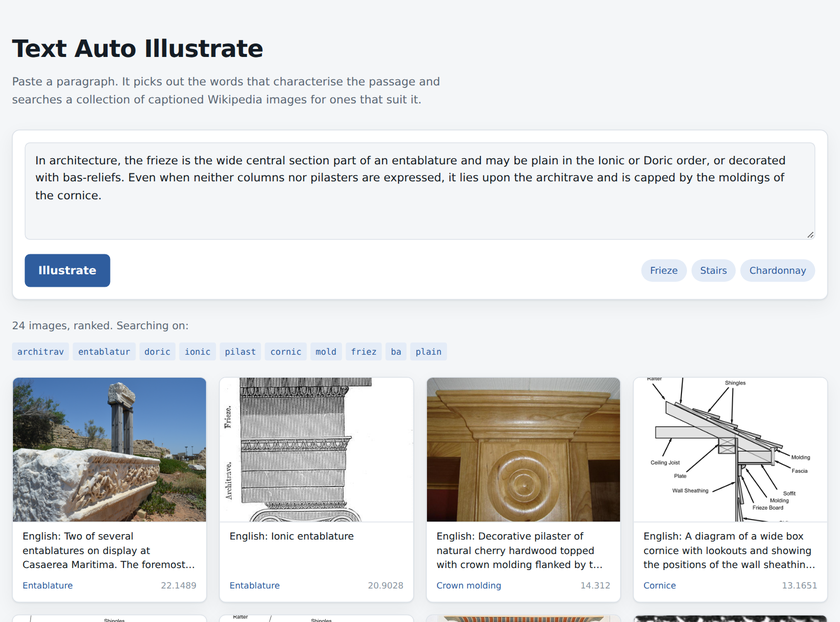
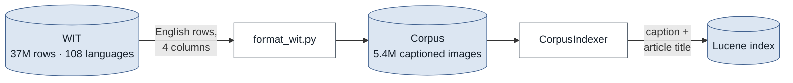
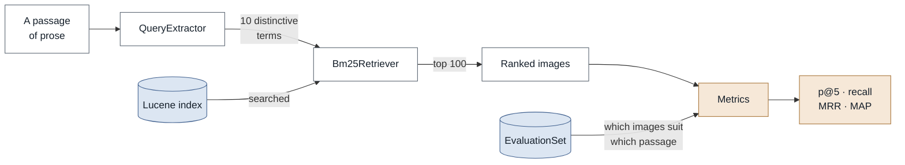
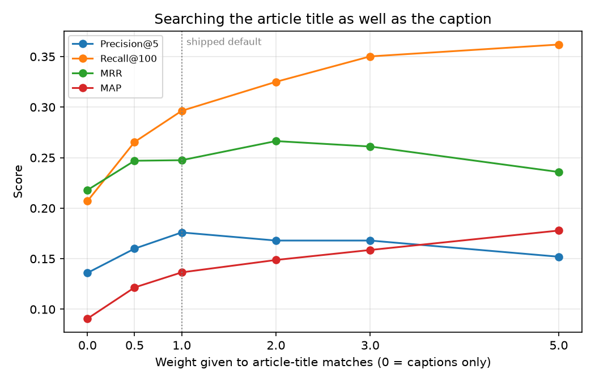
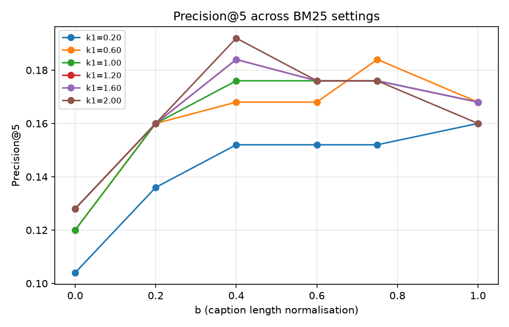

<h1 align="center">Text Auto Illustrate</h1>

<p align="center">
  <em>Finds images that illustrate a passage of text.</em>
</p>

<p align="center">
  <a href="https://github.com/domeist/text-auto-illustrate/actions/workflows/build.yml">
    </a>
  
  
  <a href="LICENSE"></a>
  <a href="data/LICENSE.md"></a>
  <a href="https://huggingface.co/datasets/domeist/text-auto-illustrate">
    </a>
</p>

---

Give it a paragraph. It works out which words actually characterise the passage,
searches 5.4 million captioned Wikipedia images, and hands back the ones that fit.

```console
$ text-auto-illustrate search --text "In architecture, the frieze is the wide
  central section of an entablature, often decorated with bas-reliefs."

query terms: entablatur friez ba decor relief wide architectur section central

1. Two of several entablatures at Caesarea Maritima. The "architrave" is the
   lowest part, resting on the column. Above it is the decorative band called
   the "frieze." The part jutting out along the top is the "cornice."
   https://upload.wikimedia.org/wikipedia/commons/8/80/Entablatures_at_Caesarea_Maritima.JPG

2. Ionic entablature
   https://upload.wikimedia.org/wikipedia/commons/0/02/Ionic_entablature.jpg

3. Persian frieze designs at Persepolis — palmettes and lotus.
   https://upload.wikimedia.org/wikipedia/commons/c/c1/Persian_frieze_designs_at_Persepolis.jpg
```

University of Glasgow final-year project, BSc Computer Science, 2022 — rebuilt in 2026.

## Run it in a minute

Needs a **JDK 17 or newer** — tested on 17 and 25. Nothing else: no Maven
install, no dataset download.

```bash
git clone https://github.com/domeist/text-auto-illustrate.git
cd text-auto-illustrate

./mvnw package                                     # build and test
java -jar target/text-auto-illustrate.jar index    # ~5 seconds
java -jar target/text-auto-illustrate.jar serve    # open http://localhost:8080
```

<p align="center">
  
</p>

Or stay in the terminal:

```bash
java -jar target/text-auto-illustrate.jar search --text "Your paragraph here."
```

A 283,357-image demo corpus ships in the repository, so there is nothing to
fetch. For the real thing, see [the full corpus](#the-full-corpus).

## How it works

Two problems, solved separately.

**Working out what the passage is about.** A paragraph is far too long to use as
a query, so every word is scored by how often it appears here against how rare it
is everywhere. Rare words carry the meaning — *entablature* pins down a subject
in a way *building* never will — and the top scorers become the query.

**Finding images with text.** Each image carries its Wikipedia caption and the
title of the article it appeared in. Searching those with BM25 matches text
against text; the image comes back as a side effect. Nothing ever examines a
pixel.

No model, no training, nothing learned. BM25 is a fixed formula from 1994, and
the relevance judgements exist only to mark the results afterwards.

**Building the index** happens once. WIT is filtered to English and cut down to
four columns, then indexed on two fields — the caption, and the title of the
article the image came from.



**Illustrating a passage** happens per query, and scoring is a separate step
afterwards.



Note where the judgements enter: at `Metrics`, once retrieval is already over.
They never reach the retriever, which is why nothing here can learn from them.

## Commands

| | |
|---|---|
| `index` | Build the search index from a corpus of captioned images |
| `search` | Find images for a passage — `--text` or `--file` |
| `serve` | Opens a page for pasting a passage and looking at the images |
| `evaluate` | Score the retriever against an evaluation set |
| `sweep` | Score across a grid of settings, writing CSV to plot |

`java -jar target/text-auto-illustrate.jar help` lists every option.

## Results

Against all 5,411,977 images: BM25 `k1=1.2`, `b=0.75`, 10 query terms, top 100.

| | strict | lenient |
|---:|:---:|:---:|
| **Precision@5** | 0.176 | 0.432 |
| **Recall@100** | 0.296 | 0.006 *(ceiling 0.047)* |
| **MRR** | 0.248 | 0.673 |
| **MAP@100** | 0.137 | 0.063 |
| **nDCG@100** | — | 0.163 |
| **Passages with nothing relevant in the top 5** | 16 of 25 | 4 of 25 |

### Searching the article title is worth a lot

The 2022 version searched captions alone. Captions are often useless — *"scanned
at 300 dpi from the original plate"* names no subject — while the article an
image sits in almost always does. That title was already in the corpus, hiding
in the page URL, and was only ever displayed.

<p align="center">
  
</p>

| | captions only | with titles |
|---:|:---:|:---:|
| Precision@5 | 0.136 | **0.176** |
| Recall@100 | 0.207 | **0.296** |
| MAP@100 | 0.091 | **0.137** |
| Results sharing a score | 71% | **39%** |

Recall is the figure to trust most: it turns on whether relevant images appear at
all, not precisely where. Past a weight of about 2, recall keeps climbing while
precision falls away, so the shipped default is 1.0. `--title-boost 0` restores
the old behaviour.

### Reading these numbers honestly

**The scores understate the system.** 16 of 25 strict passages score zero at
rank 5 — but look at what they return and the images are often plainly suitable,
just absent from the answer key. A passage on fur-trade forts returns Hudson's
Bay Company trading posts and scores nothing. The strict judgements are
incomplete; the lenient set exists to compensate.

**Lenient recall cannot approach 1.** It judges about 4,400 images relevant per
passage while only 100 are ever retrieved, capping recall at 0.047. The reported
0.006 is roughly an eighth of what is reachable. `evaluate` prints the ceiling
beside the score for exactly this reason.

**Ties used to decide everything.** Short captions make identical BM25 scores
common, and tied results are ordered arbitrarily. Searching captions alone,
reordering ties moved Precision@5 across 0.120–0.152 — a range covering most of
the variation the 2022 sweep credited to `k1` and `b`, meaning that study largely
measured noise. With titles searched, all three orderings now agree exactly.
Results sort by score then document id, so runs are reproducible.

## Evaluation sets

Measuring this needed ground truth that did not exist. Both sets live in
[`data/evaluation/`](data/evaluation) and are reusable by anyone.

| Set | Passages | Images judged | Per passage | How |
|---|---:|---:|---:|---|
| [`strict.tsv`](data/evaluation/strict.tsv) | 25 | 722 | 28 avg | Annotated by hand |
| [`lenient.tsv`](data/evaluation/lenient.tsv) | 25 | 83,332 | 4,421 avg | Generated from article links |

Each row pairs a passage with the images judged to suit it:

```
0 ⇥ In architecture, the frieze is the wide central… ⇥ 0,4006352,2824798,…
```

Ids refer to corpus rows, so a set only means something alongside its corpus.

The lenient set grades three ways: the image WIT originally paired with the
passage, then everything else on the same article, then everything on articles
linked from it. [`source-articles.tsv`](data/evaluation/source-articles.tsv)
records the article behind each passage, and
[`tools/build_lenient_set.py`](tools/build_lenient_set.py) rebuilds it.

```bash
java -jar target/text-auto-illustrate.jar evaluate --set strict --verbose
```

### Using the sets without this code

Both are published on Hugging Face as
[`domeist/text-auto-illustrate`](https://huggingface.co/datasets/domeist/text-auto-illustrate),
reshaped into TREC-style qrels — one row per passage–image pair — and bundled
with caption and URL for all 83,357 judged images. That makes the benchmark
self-contained: you can score a system against it without building the corpus.

```python
from datasets import load_dataset

passages = load_dataset("domeist/text-auto-illustrate", "passages")["train"]
qrels    = load_dataset("domeist/text-auto-illustrate", "qrels_strict")["train"]
images   = load_dataset("domeist/text-auto-illustrate", "images")["train"]
```

## Demo corpus and full corpus

The full corpus is 1.6 GB of captions and cannot sensibly live in a git
repository. The bundled demo holds every image either evaluation set judges,
plus 200,000 random distractors.

| | demo | full |
|---|---:|---:|
| Images | 283,357 | 5,411,977 |
| In the repository | 31 MB | — |
| Index build | 5 seconds | 95 seconds |
| Precision@5, strict | 0.256 | 0.176 |

It demonstrates the pipeline; it does not reproduce the published figures. With
27× fewer wrong answers to sift, everything scores higher.

> **The demo flatters the lenient set badly.** 83,357 of its 283,357 images are
> judged relevant to some passage — 29% of the corpus. Lenient Precision@5 reads
> 0.704 there against 0.432 on the full corpus. Use the full corpus for anything
> you intend to quote.

### The full corpus

All 5,411,977 images, 566 MB gzipped, attached to the
[latest release](../../releases/latest):

```bash
curl -L -o data/corpus/wit-corpus-en.tsv.gz \
  https://github.com/domeist/text-auto-illustrate/releases/latest/download/wit-corpus-en.tsv.gz
rm data/corpus/demo.tsv.gz        # the demo is a subset of it
java -jar target/text-auto-illustrate.jar index --corpus data/corpus --index index
```

About 95 seconds to index, producing a 1.4 GB index. The results above were
measured from exactly this archive.

To build it from scratch instead, download the
[WIT](https://github.com/google-research-datasets/wit) training split and run
[`tools/format_wit.py`](tools/format_wit.py).

## Reproducing the experiments

```bash
java -jar target/text-auto-illustrate.jar sweep --what bm25   --out results
java -jar target/text-auto-illustrate.jar sweep --what terms  --out results
java -jar target/text-auto-illustrate.jar sweep --what titles --out results

python3 -m venv .venv
.venv/bin/pip install -r tools/requirements.txt
.venv/bin/python tools/plot_results.py --results results
```

Charts land in `results/plots/`. The ones in this README, plus recall, MRR, MAP
and query-length plots not shown here, are committed in [`docs/`](docs). The
virtual environment is not optional on recent Debian and Ubuntu, where a plain
`pip install` is refused.

<p align="center">
  
</p>

The grid runs `k1` to 2.0 deliberately: the 2022 study stopped at 1.0 and so
never tested Lucene's own default of 1.2. Its best cell is `k1=2.0, b=0.4` at
Precision@5 0.192 against 0.176 for the defaults, and that gap does survive
tie-reordering.

**The defaults ship regardless.** That is the best of 36 cells picked on 25
passages, worth two extra relevant results in the entire evaluation. Taking the
maximum of a grid on a test set that small is how you publish a number that does
not survive new data. Worth running, worth reading, not worth tuning to.

## Layout

```
src/main/java/autoillustrate/
  index/     Building the Lucene index from a corpus file
  query/     Reducing a passage to its most distinctive terms
  retrieve/  The Retriever interface and its BM25 implementation
  eval/      Evaluation sets, measures, and parameter sweeps
  cli/       Command-line entry point
data/
  corpus/       The bundled demo corpus
  evaluation/   Both evaluation sets and their provenance
tools/          Corpus preparation, set generation, plotting
```

`Retriever` is an interface, so a retriever built on image embeddings could drop
in and be measured against the same sets. That, and other things worth doing
next, are in the [roadmap](ROADMAP.md).

## Dissertation

The dissertation, status report and presentation are attached to the
[latest release](../../releases/latest) rather than stored here, which keeps
clones small.

## Licence

**Code** — [MIT](LICENSE).

**Data** — [CC BY-SA 3.0](data/LICENSE.md). Everything under `data/` comes from
Wikipedia, via [WIT](https://github.com/google-research-datasets/wit) for the
corpus and directly for the evaluation passages, and carries Wikipedia's
share-alike licence rather than the code licence. Only image URLs are
redistributed, never image files.

The 2022 version was built on [Luc4IR](https://github.com/gdebasis/luc4ir), a
teaching framework by Debasis Ganguly, who supervised the project. The 2026
rewrite shares no code with it.
